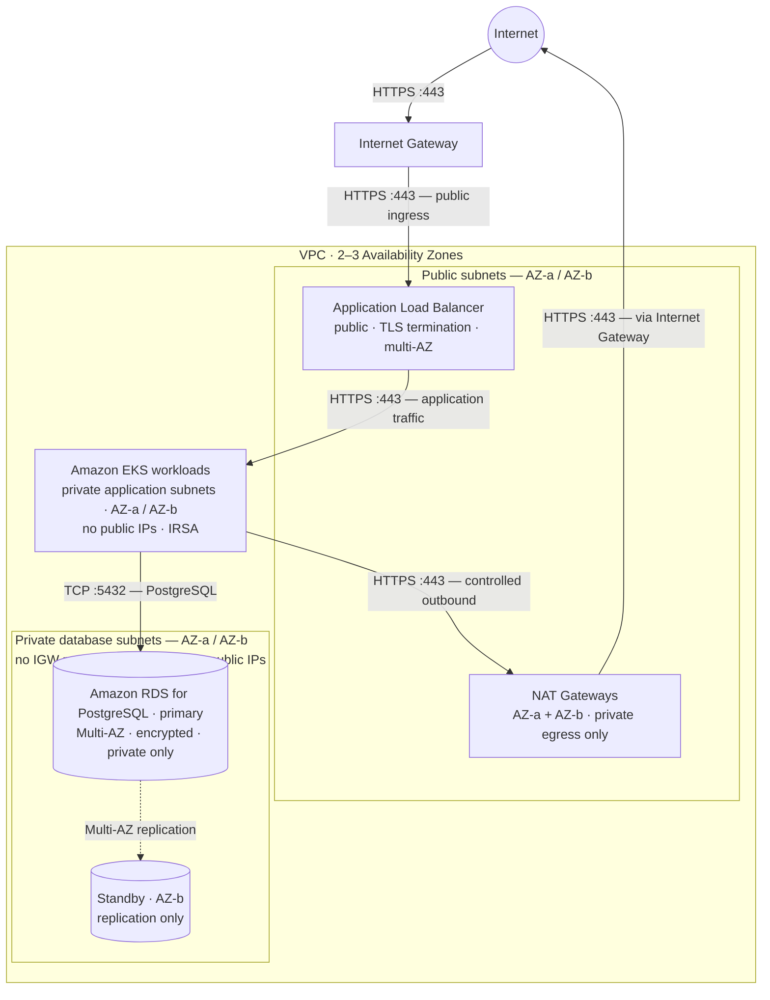
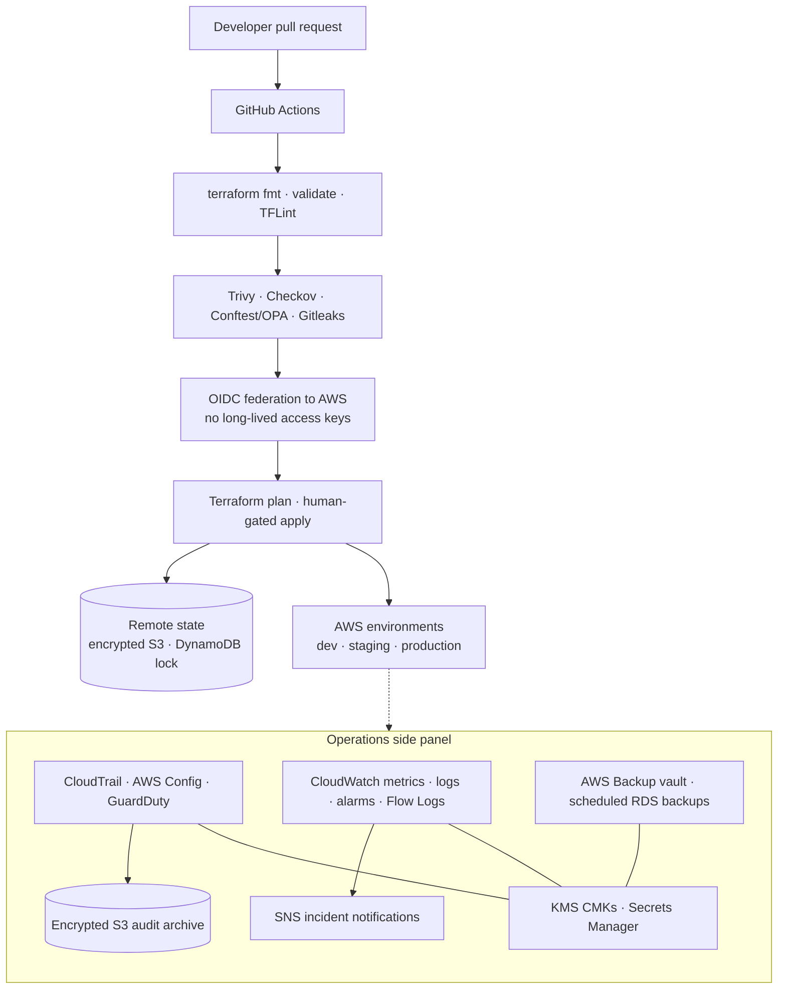

# AWS foundation (Terraform)

Portfolio IaC for a **single-account AWS app platform**: private Amazon EKS + Amazon RDS for PostgreSQL behind a public Application Load Balancer, with encryption, IRSA, backups, policy-as-code CI, and per-environment state. Not a live production account and not a compliance certification.

**Cost:** `terraform apply` bills for NAT, ALB, EKS, RDS, etc. Prefer `single_nat_gateway = true` for demos; destroy when done. Production examples use **one NAT Gateway per AZ**.

## Architecture

Two diagrams on purpose: **runtime networking** (traffic only) and **delivery / security / operations** (how changes and controls reach AWS). Mixing those in one picture hides the request path.

---

### 1. Runtime / network architecture



**EKS control plane:** private API endpoint (side note — not on the application path; reach via VPN/SSM after apply).

**Non-prod:** `single_nat_gateway = true` (one NAT). **Production:** one NAT Gateway per AZ, as drawn.

There is **no** path `Internet → NAT Gateway`. NAT is private-subnet outbound only; public ingress is always Internet → Internet Gateway → ALB.

#### Routing

| Subnet tier | Destination | Target |
|-------------|-------------|--------|
| Public | VPC CIDR | local |
| Public | `0.0.0.0/0` | Internet Gateway |
| Private application | VPC CIDR | local |
| Private application (prod) | `0.0.0.0/0` | NAT Gateway **in the same AZ** |
| Private database | VPC CIDR | local |
| Private database | `0.0.0.0/0` | **none** (no IGW, no NAT) |

#### Trust boundaries

| Boundary | Inbound | Outbound |
|----------|---------|----------|
| ALB security group | TCP 443 from `0.0.0.0/0` | Application ports to EKS node / workload SG |
| EKS node / workload SG | Application ports from ALB SG only | TCP 5432 to RDS SG; TCP 443 via NAT / VPC endpoints |
| RDS security group | TCP 5432 from EKS SG only | VPC-local as required |
| Database subnets | Private only | No public IPs · no IGW · no NAT |

There is **no** path `Internet → NAT Gateway`. NAT is private-subnet **outbound only**.

---

### 2. Delivery / security / operations architecture



| Control | Implementation in this repo |
|---------|-----------------------------|
| IaC layout | Modules + `environments/{dev,staging,prod}` (separate state) |
| CI gates | fmt, validate, TFLint, Trivy, Checkov, Conftest, OPA, Gitleaks on PR |
| Cloud auth | Manual plan via GitHub OIDC — no long-lived AWS keys in CI |
| Secrets | RDS master password in Secrets Manager (never in tfvars) |
| Encryption | Per-service KMS CMKs (S3, RDS, EKS secrets, logs, SNS, Backup, …) |
| Identity | OIDC provider + IRSA roles + EKS access entries |
| Prod detection | CloudTrail, GuardDuty, Config enabled in prod examples |
| Recovery | AWS Backup vault + daily plan + RDS selection |

**Out of scope (intentional):** multi-account Organizations / Control Tower, multi-region DR, Helm/GitOps providers in Terraform, ACM certificate issuance (bring your own ARN for HTTPS on the ALB).

Apply only from `environments/{dev,staging,prod}`. `examples/full-stack` is validate-only (no remote backend).

## Layout

```
modules/          networking, security, storage, database, eks, alb, observability
environments/     deployable roots (dev, staging, prod) — separate state each
policies/         Conftest + OPA
.github/workflows validate, security scan, manual OIDC plan
```

## Validate (no AWS credentials)

```bash
make fmt && make validate && make test
```

CI on PR: fmt/validate, TFLint, Trivy, Checkov, Conftest fixtures, OPA, Gitleaks.  
Plan is **manual only** (OIDC → `aws-plan` environment; no long-lived keys, no apply on PR).

## Deploy (optional)

1. Bootstrap S3 + DynamoDB state out of band  
2. `cd environments/<env>`  
3. Copy `backend.hcl.example` → `backend.hcl` and `terraform.tfvars.example` → `terraform.tfvars`  
4. Set `cluster_admin_principal_arns`, optional `alb_certificate_arn`, `allowed_admin_cidrs`  
5. `terraform init -backend-config=backend.hcl && terraform plan`

MIT — [LICENSE](LICENSE)
